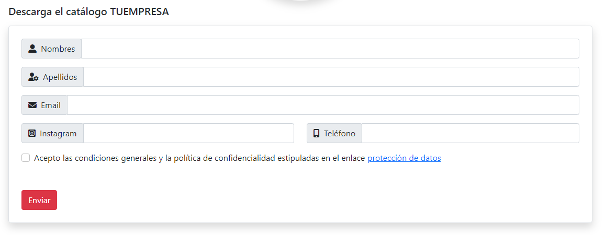

<h1>
Formulario de inscripción con descarga de catalogo
</h1>

El usuario llena el formulario de inscripción para luego ser redireccionado a la página de descarga del catálogo (formulario-de-inscripcion.php)

El formulario envía los datos a enviar-ino-inscripcion.php donde se crea y se envian los correos electrónicos; también guarda los datos en la base de datos.

Por ultimo hace una redirección al archivo index.php donde se encuentra el botón para descargar el catálogo

Reemplaza por tus datos donde dice 'TUEMPRESA' en cada fichero PHP. También debes actualizar los datos en bd_conect.php y la dirección donde se encuentra tu catálogo en el fichero index.php en la variable fileURL 

